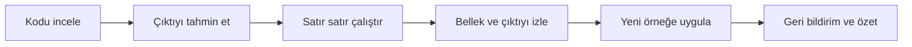
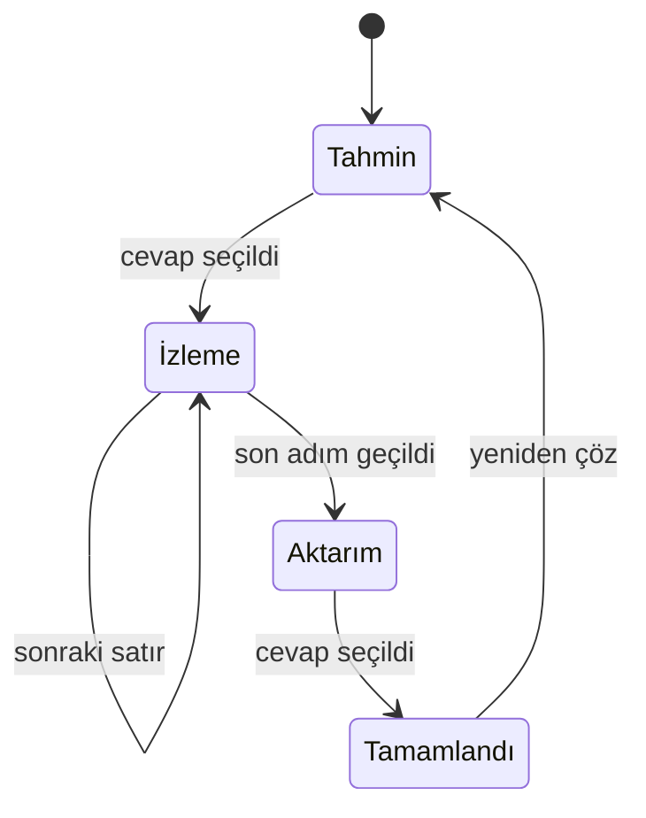
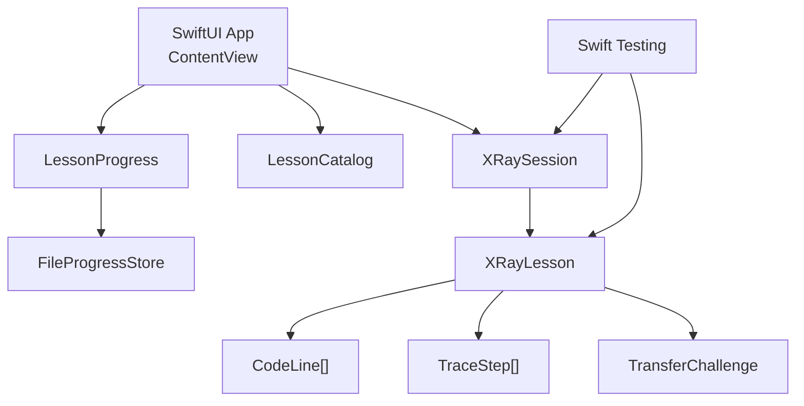

# Tasarım Belgesi

## Deneyim hedefi

GrillMe, bir video kursu veya mobil kod editörü gibi hissettirmemelidir. Deneyim
bir düşünme laboratuvarı gibi çalışır: kullanıcı önce tahmin eder, sonra
bilgisayarın yürüttüğü adımları görür ve en sonunda öğrendiği zihinsel modeli
yeni bir örneğe taşır.

Temel ders döngüsü:

## Bilgi mimarisi

Planlanan ana alanlar:

1. **Bugünün dersi:** Kullanıcının kaldığı yerden devam ettiği kısa oturum
2. **Öğrenme yolu:** Temelden profesyonel kavramlara uzanan bölüm haritası
3. **Kod Röntgeni:** Ders içindeki ana çalışma ve inceleme deneyimi
4. **Hata Avcılığı:** Mantık hatası bulma ve hipotez kurma görevleri
5. **Kavram haritası:** Fonksiyon, class, state ve benzeri yapıların ilişkileri
6. **Profil ve ilerleme:** Seri, tamamlanan dersler ve beceri gelişimi

İlk MVP, Bugünün dersi, Öğrenme yolu ve Kod Röntgeni ile sınırlı tutulabilir.

## Kod Röntgeni lensleri

Her lens aynı ders verisini farklı bir zihinsel modelle açıklar:

| Lens | Gösterdiği bilgi | MVP |
| --- | --- | --- |
| Türkçe | Satırın günlük dilde anlamı | Evet |
| Akış | Şu an çalışan ve sonra çalışacak satır | Evet |
| Hafıza | Değişkenlerin o andaki değerleri | Evet |
| Çıktı | Ekrana veya konsola üretilen değer | Evet |
| Çağrı | Fonksiyonların çağrı ve dönüş sırası | Sonraki |
| Mimari | Class, instance ve bağımlılık ilişkileri | Sonraki |
| Hata | Kırılabilecek satırlar ve edge case'ler | Sonraki |
| Kalite | Okunabilirlik ve tasarım sorunları | Daha sonra |
| Dil | Aynı mantığın farklı dillerdeki karşılığı | Daha sonra |

## Ders tasarım kalıbı

Her ders şu parçalardan oluşmalıdır:

1. **Kanca:** Günlük hayattan veya gerçek uygulamadan kısa bir problem
2. **Kod:** Tek ana kavrama odaklanan küçük örnek
3. **Tahmin:** Çıktı, sıra veya hata hakkında zorunlu seçim
4. **Yürütme:** En anlamlı satırların adım adım gösterimi
5. **Açıklama:** “Ne oldu?” değil, “neden oldu?” cevabı
6. **Aktarım görevi:** Küçük bir değişiklik sonrası yeni sonucu tahmin etme
7. **Özet:** Tek cümlelik kalıcı zihinsel model

Bir ders mümkünse tek ana davranış öğretmeli. Başlıkta veya kabul ölçütünde “ve”
bağlacı çoğalıyorsa ders bölünmelidir.

## Etkileşim durumları

Kod Röntgeni oturumunun mevcut durum makinesi:

Kurallar:

- Cevap seçilmeden yürütme izi açılmaz.
- Cevap seçildikten sonra seçim değiştirilmez.
- Yanlış cevapta kullanıcı doğrudan doğru cevaba ışınlanmaz.
- Son adımda bellek ve çıktı görünür kalır.
- Aktarım görevi tamamlanmadan ders tamamlanmış sayılmaz.
- Aktarım cevabından sonra doğru sonuç ve gerekçesi birlikte gösterilir.
- Yeniden çözme temiz bir oturum başlatır.

## Görsel sistem

### Karakter

- Karanlık ve odaklı
- Teknik fakat ürkütmeyen
- Canlı vurgu renkleriyle çalışma durumunu görünür kılan
- Oyunlaştırılmış fakat çocukça olmayan

### Renk rolleri

| Rol | Mevcut kullanım |
| --- | --- |
| Koyu zemin | Ana uygulama ve kod alanı |
| Mint | Aktif satır, ilerleme ve birincil eylem |
| İndigo | Kod anahtar kelimeleri ve ikincil vurgu |
| Amber | Seri, dikkat ve öğretici sonuç |
| Beyaz tonları | Başlık, gövde ve ikincil metin hiyerarşisi |

Renk hiçbir zaman tek durum göstergesi olmamalıdır; ikon, metin veya biçimle
desteklenmelidir.

### Tipografi

- Başlıklar: Rounded sistem fontu
- Kod ve değerler: Monospaced sistem fontu
- Yardımcı metinler: Kısa, doğrudan ve günlük Türkçe
- Kod satırları, Dynamic Type büyüdüğünde yatay kırılmadan okunabilir kalmalıdır

### Ana bileşenler

- Gün ve ilerleme başlığı
- Ders başlığı ve kısa yönlendirme
- Kod kartı
- Tahmin seçenekleri
- Tahmin sonucu
- İzleme açıklaması
- Hafıza kartı
- Çıktı kartı
- Aktarım kodu ve cevap seçenekleri
- Aktarım sonucu ve gerekçeli geri bildirim
- Sonraki satır ve yeniden çöz eylemleri

## İçerik yazım kuralları

- “Bu satır değişken tanımlar” yerine neyin nerede tutulduğunu anlat.
- Teknik terimi ilk kullanımda sade Türkçe karşılığıyla birlikte ver.
- Kullanıcıyı küçümseyen “kolay”, “basitçe” gibi ifadelerden kaçın.
- Yanlış cevap metni yargılayıcı olmamalı.
- Açıklama mümkünse 1–2 kısa cümlede bitmeli.
- Aynı kavram en az iki farklı bağlamda tekrar kullanılmalı.
- Kod örnekleri gerçek dil kurallarına uymalı ve gerektiğinde derlenerek
  doğrulanmalı.

## Erişilebilirlik

MVP kabul ölçütleri:

- Tüm butonların açıklayıcı erişilebilirlik etiketi veya görünür metni vardır.
- Salt renkle anlatılan durum yoktur.
- Dynamic Type ile temel akış tamamlanabilir.
- VoiceOver sırası görsel sırayla uyumludur.
- Dokunma hedefleri en az 44×44 punto olmalıdır.
- Metin ve zemin kontrastı okunabilirlik standardını karşılamalıdır.
- Hareket azaltma ayarında anlam taşıyan animasyonlar sadeleşmelidir.

## Teknik mimari

Mevcut ayrım:

### Katman sorumlulukları

**Core**

- Ders veri modeli
- Tahmin değerlendirmesi
- Oturum durum geçişleri
- Aktif yürütme adımı
- UI'dan bağımsız ve Swift Package testleriyle doğrulanabilir davranış
- Ders sırası ve kilit açma kuralları
- JSON tabanlı kalıcı ilerleme

**App**

- SwiftUI görünüm hiyerarşisi
- Renk, tipografi ve animasyon
- Kullanıcı eylemlerini `XRaySession` metodlarına iletme
- Oturum durumunu ekrana dönüştürme

### Mevcut ve gelecek ayrımlar

İçerik ve ekran sayısı arttığında:

- `LessonCatalog`: Ders sırası ve kilit açma kuralları — mevcut
- `FileProgressStore`: Yerel JSON ilerleme deposu — mevcut
- `ProgressStore` protokolü: Birden fazla depo gerektiğinde
- `LessonRepository`: Paketlenmiş JSON veya Swift verisini yükleme
- `AppRoute`: Ders haritası ve detay ekranı navigasyonu
- `CodeLanguage`: Swift, Python ve JavaScript gösterim seçeneği

Erken aşamada gereksiz servis, ağ katmanı veya karmaşık mimari eklenmemelidir.

## Ders veri sözleşmesi

Bir ders yayınlanmadan önce:

- Doğru cevap seçenekler içinde bulunur.
- Her yürütme adımının satır numarası kaynak kodda vardır.
- Son çıktı, doğru cevapla tutarlıdır.
- Yürütme adımları gerçek çalışma sırasındadır.
- Bellek görüntüsü önceki adımla çelişmez.
- Aktarım görevinin doğru cevabı seçenekler içinde bulunur.
- Aktarım kodu, ana dersteki zihinsel modeli yeni bir bağlamda kullanır.
- Ders tek bir ana öğrenme hedefi taşır.
- Açıklamalar Türkçe içerik kontrolünden geçer.

Bu koşullar mümkün olduğunca otomatik testlerle korunmalıdır.
