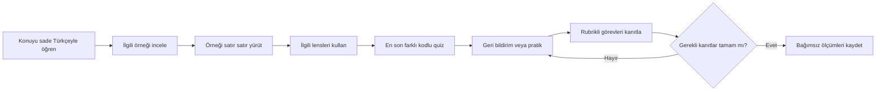
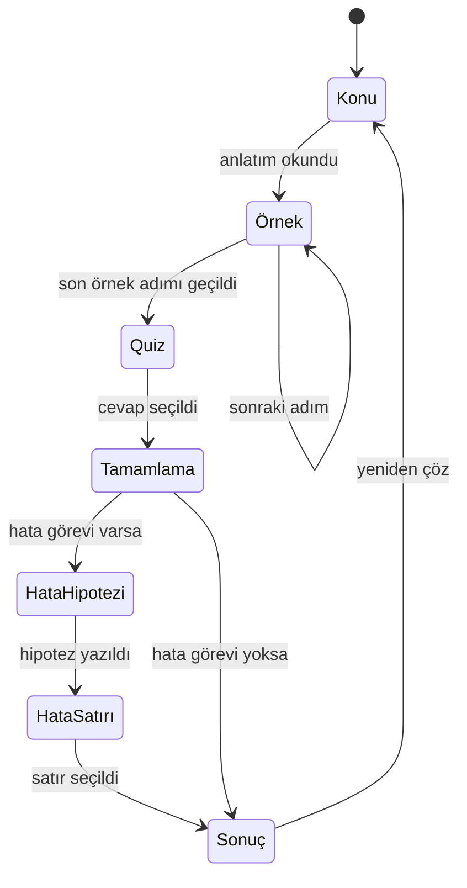
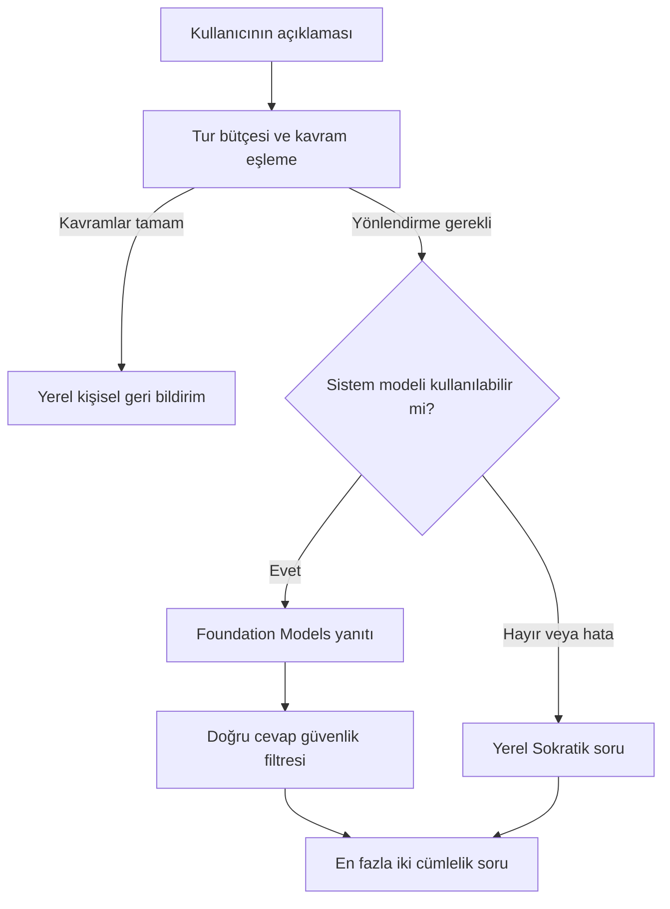
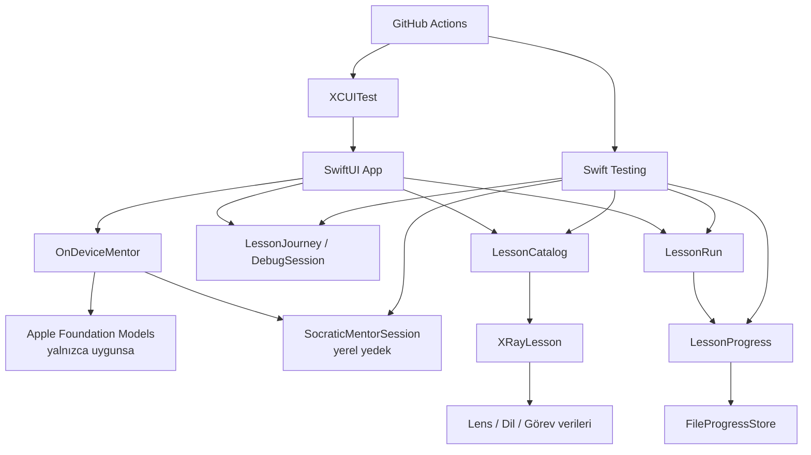

# Tasarım Belgesi

## Deneyim hedefi

GrillMe bir video kursu ya da mobil kod editörü değildir. Kullanıcıyı pasif
izleyiciden, kodun çalışması hakkında kanıt kullanan aktif bir okuyucuya
dönüştüren düşünme laboratuvarıdır.

## Bilgi mimarisi

Uygulama iki tamamlayıcı giriş biçimi sunar:

1. **Yol Haritası:** 40 açık ders, on bölüm, önerilen sıra ve süre
2. **İçindekiler:** tüm derslere serbest erişim, bölüm filtresi ve Türkçe
   karakterlerden bağımsız kavram araması
3. **İlerleme özeti:** seri, tamamlanan ders, haftalık süre ve doğruluklar
4. **Konu anlatımı:** hedefi ve kalıcı zihinsel modeli sade Türkçeyle öğretme
5. **Kod Röntgeni örneği:** aktif satır, bellek, çıktı ve bağlamsal lensler
6. **Ders sonu quiz:** aynı zihinsel modeli farklı kodda bağımsız kullanma
7. **Hata avcılığı:** hipotez, satır seçimi ve kanıt
8. **Pratik/değerlendirme:** isimlendirme, kavram, mimari ve capstone görevleri
9. **Sokratik mentor:** cevabı vermeden öğrencinin açıklamasını ilerletme

## Müfredat yapısı

| Bölüm | Dersler | Ana beceri |
| --- | ---: | --- |
| Temeller | 1–4 | Değer, koşul, döngü ve karışık akış |
| Fonksiyonlar | 5–11 | Çağrı, parametre, return, scope, side effect, map/filter |
| Koleksiyonlar | 12–14 | Array, dictionary, index, key ve değişim |
| Nesneler | 15–21 | Class, instance, davranış, yaşam döngüsü ve mimari |
| Debugging | 22–27 | Hata türü, edge case, optional, stack trace ve hipotez |
| Asenkron | 28 | Olayların gerçekleşme sırası |
| Uygulama mimarisi | 29 | Gerçek uygulamadaki veri ve çağrı akışı |
| Değerlendirme | 30 | 20 satırlık bağımsız kod okuma görevi |
| Yazılım testi | 31–35 | Davranışı izole etme, sınırları ve gerilemeyi doğrulama |
| Teknik analiz | 36–40 | İsteği ölçülebilir, riskleri görünür bir uygulama planına çevirme |

## Kod Röntgeni lensleri

Lensler ders verisinden otomatik açılır; bir derste veri yoksa boş bir kontrol
gösterilmez.

| Lens | Gösterdiği zihinsel model |
| --- | --- |
| Akış | Çalışan satır ve yürütme sırası |
| Hafıza | Değişkenlerin o andaki değerleri |
| Çıktı | Programın dışarı ürettiği değer |
| Çağrı | Fonksiyon çerçeveleri, yerel değerler ve dönüş sırası |
| Mimari | Class, instance, değer ve fonksiyon ilişkileri |
| Hata | Beklenen/gerçek değer, hata türü ve kanıt |
| Dil | Aynı mantığın Swift, Python, JavaScript ve Java sözdizimi |

## Ders veri kalıbı

Her yayınlanabilir ders şunları taşır:

1. Kimlik, sıra, bölüm, konu, hedef, kalıcı çıkarım ve tahmini süre
2. Çalışabilir kaynak satırları
3. Neden önemli, sık hata ve gerçek proje bağlamı taşıyan konu anlatımı
4. Gerçek sıraya uygun en az üç rehberli örnek adımı
5. Bellek, çıktı ve varsa çağrı/mimari görüntüsü
6. Örnekten farklı kod kullanan ders sonu quiz
7. Gerekiyorsa hata, pratik veya cevap alanı ve rubrik taşıyan değerlendirme
8. Varsa dil varyantları ve syntax/mantık karşılaştırması

`LessonValidator`; boş kodu, seçenekler dışındaki doğru cevabı, geçersiz satır
numarasını, yetersiz yürütme izini, geçersiz süreyi ve bozuk aktarım görevini
reddeder.

## Etkileşim durumları

Kurallar:

- Yol Haritası sırayı önerir; Yol Haritası ve İçindekiler bütün dersleri açar.
- Her iki giriş biçimi de aynı ders ekranını ve aynı ilerleme kaydını kullanır.
- Quiz, konu anlatımı ve rehberli örnek tamamlanmadan açılamaz.
- Quiz kodu rehberli örneğin kodundan farklıdır.
- Yanlış quiz cevabı açıklayıcı geri bildirimi engellemez.
- Quiz yapılmadan ders tamamlanmış sayılmaz.
- Hata görevinde hipotez yazılmadan satır seçilemez.
- Dersin bütün pratik soruları ve değerlendirme görevleri cevaplanmadan
  tamamlama açılmaz; yanlış kanıt saklanır ve geri bildirim üretir.
- Yeniden çözme bütün geçici ders ve mentor durumunu temizler.
- Tamamlama tek bir `LessonRunResult` üretir; deneme ve olaylar birlikte
  kaydedilir.

## Mentor tasarımı

- Tur limiti ders başına altıdır.
- Model istemi hedefi, kodu, kullanıcı açıklamasını ve eşleşen kavramları taşır;
  `correctAnswer` alanını taşımaz.
- Üretilen metin doğru cevabı içerirse cevap yer tutucuyla gizlenir.
- iOS 26/Apple Intelligence uygunluğu yoksa ağ isteği yapılmadan yerel yanıt
  kullanılır.
- Mentor sonucu üretmez; kanıta götüren tek bir soru sorar.

## Ölçüm ve ilerleme

`LessonAttempt`; ders kimliği, tamamlama zamanı ve sürenin yanında üç bağımsız
kanıtı saklar: quiz doğruluğu, pratik doğruluk yüzdesi ve rubrik puanı.
Türetilen göstergeler:

- Günlük seri
- Son yedi günlük ders ve pratik süresi
- Quiz doğruluğu
- Ek pratik doğruluk yüzdesi
- Açık uçlu değerlendirme rubrik puanı
- Aynı dersin tekrar deneme quiz doğruluğu
- Karşılaştırılabilir tek boyut olarak ilk üç ders quizi ile capstone quizi
  arasındaki gelişim

Olay sözleşmesi `lesson_started`, `quiz_submitted`, `practice_submitted`,
`assessment_submitted`, `lesson_completed` adlarını kullanır. Olaylarda kişi
adı, e-posta veya serbest cevap metni bulunmaz. Olaylar ilerleme dosyasında
cihaz içinde kalıcıdır; dış servise gönderilmez.

`AssessmentRubric` kavramları harf/sayı sınırlarıyla eşler; örneğin `6`, `16`
içinden yanlışlıkla puan kazanmaz. Bu puan otomatik bir insan değerlendirmesi
iddiası değildir: öğrenciye açık kavram kapsama sinyali ve örnek yaklaşım verir.

## Görsel sistem

- Koyu, odaklı ve yetişkinlere yönelik görünüm
- Mint: ilerleme, aktif satır ve birincil eylem
- İndigo: lens, dil ve mentor
- Amber: seri, dikkat ve öğretici sonuç
- Rounded sistem fontu; kod ve değerlerde monospaced sistem fontu
- Renk her zaman metin, ikon veya şekille desteklenir

## Erişilebilirlik

- Eylemler görünür metin veya açıklayıcı erişilebilirlik etiketi taşır.
- Ders satırları başlık, sıra ve tamamlanma durumunu tek VoiceOver açıklamasında
  birleştirir.
- İlerleme ve haftalık özetler semantik gruplardır.
- Dynamic Type, erişilebilir boyutlarda üst başlığı dikey düzene geçirir.
- Ders kartları ve haftalık özet erişilebilir boyutlarda tek sütuna geçer.
- Kod satırları büyüdüğünde kırılmak yerine yatay kaydırılır.
- Dört dilli segmented picker erişilebilir boyutta menüye dönüşür.
- Metinler büyüyebilir ve ana içerik dikey kaydırılabilir.
- Seçim durumları yalnızca renkle anlatılmaz; ikon ve metinle desteklenir.
- Birincil butonlarda en az 44 punto dokunma yüksekliği korunur.

## Teknik mimari

### Core

- Ders ve müfredat verisi
- Durum makineleri ve değerlendirme
- Lens, dil, debugging ve görev modelleri
- Deneme, seri, haftalık özet, gelişim ve olay sözleşmesi
- Yerel Sokratik mentor, güvenli istem ve cevap filtresi
- JSON kalıcılığı
- Bozuk kayıt yedeği ve görünür kayıt hatası

### App

- SwiftUI yerleşimi, tipografi, renk ve navigasyon
- Kullanıcı eylemlerini Core davranışlarına bağlama
- Foundation Models uygunluk kontrolü ve asenkron çağrı
- Uygun olmayan sistemlerde yerel mentor yedeği

## Kavramın taşınabilir çekirdeği

GrillMe bir kavram, GrillMe:Code onun kod okuma alanındaki uygulamasıdır. Başka
bir alan (örneğin GrillMe:Music) aynı kavramı kullanacaksa taşınacak şey ders
içeriği değil, **öğrenme motorudur**.

Bugünkü `Core` bu ayrımı zaten büyük ölçüde taşıyor:

| Dosya | Ne yapar | Alana bağlı mı |
| --- | --- | --- |
| `ProgressStore.swift` | Deneme kaydı, seri, haftalık özet, gelişim raporu, kalıcılık | Hayır |
| `ReviewQueue.swift` | Aralıklı tekrar sırası | Hayır |
| `LearningAnalytics.swift` | Olay sözleşmesi | Hayır |
| `LessonRun.swift` | Oturum sonucu ve dashboard | Hayır |
| `MentorCoordinator.swift` | Modele gidilecek mi kararı, cevap sızıntısı filtresi | Hayır |
| `ConceptMatcher.swift` | Ek toleranslı kavram eşleştirme | Hayır (dile bağlı) |
| `LessonEvidence.swift` | Kanıt toplama ve tamamlama kapısı | Neredeyse hayır |
| `LessonJourney.swift` | Konu → örnek → quiz durum makinesi | Adım tipine bağlı |
| `GrillMeCore.swift`, `AdvancedLenses.swift`, `LanguageBridge.swift` | `XRayLesson`, lensler, diller | **Evet** |
| `IntroLesson`, `WeekOneLessons`, `RoadmapLessons` | Ders içeriği | **Evet** |

Yeni bir alanın değiştirmesi gereken tek şey "bir adım nedir ve o adımda hangi
iç durum görünür" sorusunun cevabıdır. GrillMe:Code'da adım bir kod satırı,
görünen durum bellek/çıktı/çağrı yığınıdır. GrillMe:Music'te adım bir ölçü ya da
akor geçişi, görünen durum ton/derece/parmak konumu olabilir; motor aynı kalır.

**Ne zaman ayıklanmalı:** şimdi değil. Tek örnekten çıkarılan soyutlama
genellikle yanlış yerden bölünür. Doğru sıra ikinci uygulamayı yazarken motoru
kopyalamak, üçüncüde ortak paketi çıkarmaktır. `Core`'un SwiftUI'dan bağımsız,
değer tipli ve ağsız olması bu ayıklamayı ileride ucuz tutar; bugün yapılacak
tek şey bu ayrımı bozmamaktır.

## Kapsam sınırı

Bu sürümde backend, hesap, bulut senkronizasyonu, serbest kod derleme, sosyal
özellik veya ödeme yoktur. Karmaşık servis katmanları ancak doğrulanmış kullanıcı
ihtiyacı ortaya çıktığında eklenmelidir.
