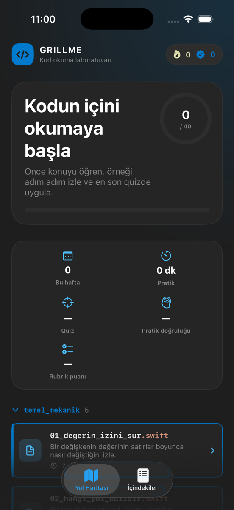
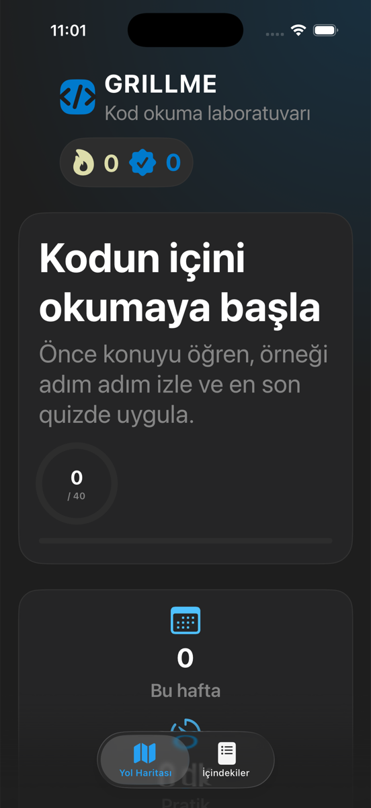

# GrillMe:Code

**GrillMe** bir öğrenme kavramıdır: önce konuyu öğret, sonra çalışan bir örneği
adım adım ve iç durumu görünür biçimde izlet, en son öğrenileni farklı bir
örnekte sınat; kanıt gösterilmeden ders tamamlanmasın, mentor cevabı vermesin ve
biten konular aralıklı tekrarla geri gelsin.

**GrillMe:Code** bu kavramın kod okuma alanındaki uygulamasıdır: sözdizimi
ezberletmek yerine çalışan kodu okumayı ve programcı gibi düşünmeyi öğretir.

> Önce konuyu öğren, çalışan bir örneği bilgisayarın adımlarıyla izle ve en son
> öğrendiğini farklı kodlu quizde uygula.

Uygulama 30 derslik temel yolu ve ardından gelen 10 derslik uzmanlaşma yolunu;
konu anlatımı, rehberli Kod Röntgeni örneği, ders sonu quiz, hata avcılığı ve
Sokratik mentor döngüsüyle sunar. Yol Haritası ve İçindekiler bütün dersleri
baştan erişilebilir tutar; Yol Haritası yeni başlayanlara önerilen sırayı,
İçindekiler ise bölüm ve arama üzerinden serbest gezinmeyi sunar.

Bunun yanında **Kavram Kitaplığı** adında bir okuma katmanı vardır: kod okuma
pratiğinin altındaki kavramsal zemini Markdown dersler hâlinde anlatır. İki
katman birbirinin yerine geçmez — kod okuma "ne oluyor", kavram dersleri "neden
böyle" sorusunu cevaplar ve ilerlemeleri ayrı sayılır.



## Belgeler

- [INTENT.md](INTENT.md): Ürün vizyonu, hedef kullanıcı ve kapsam sınırları
- [MEMORY.md](MEMORY.md): Kalıcı kararlar ve güncel teknik durum
- [DESIGN.md](DESIGN.md): Öğrenme deneyimi, arayüz sistemi ve mimari
- [ROADMAP.md](ROADMAP.md): Tamamlanan teslim aşamaları ve kabul ölçütleri

## Ürün durumu

Uygulama uçtan uca çalışır ve 40 dersin tamamı oynanabilir. Ancak **hiçbir ders
henüz gerçek bir öğrenciyle denenmedi**; aşağıdaki kapsam tablosu neyin ne kadar
derinleştiğini olduğu gibi gösterir.

### Her derste var

- 40 dersin tamamına Yol Haritası ve İçindekiler üzerinden serbest erişim;
  önerilen sıra, bölüm filtresi ve Türkçe karakterlerden bağımsız arama
- Konu anlatımı → rehberli örnek → farklı kodlu quiz sırasını zorunlu tutan
  ders yolculuğu
- Rehberli örnekten farklı kod kullanan, dört seçenekli ve üç soruluk quiz
  havuzundan gelen ders sonu quizi; yeniden çözmede sıradaki soru sorulur
- Aktif satır, adım adım değişen bellek ve çıktı görünümü
- Quiz yapılmadan dersin tamamlanmasını engelleyen bitirme koşulu
- Yanlış bilinen ve üzerinden zaman geçen dersleri geri getiren tekrar kartı
- Tur bütçeli, cevabı vermeyen Sokratik mentor ve cevap sızıntısı filtresi
- VS Code Dark+ temelli editör arayüzü: sözdizimi renkli kod, satır numaralı
  gutter, dosya adı biçiminde ders satırları ve klasör başlıkları
- İlk açılışta altı ekranlık tanıtım ve günlük ritim seçimi

### Kavram Kitaplığı (okuma katmanı)

| Modül | Ders | Durum |
| --- | ---: | --- |
| 00 · Yönelim ve Çalışma Yöntemi | 3 | Yayında |
| 01 · Hesaplamalı Düşünme | 5 | Yayında |
| 02 · Programlamanın Temelleri | 7 | Yayında |
| 03–14 (tasarım, veri yapıları, mimari, işletim sistemleri, veritabanları, ağlar, mühendislik, test, güvenlik, dağıtık sistemler, bitirme) | — | Yakında |

- İçerik `GrillMe/Core/Learning` altında Markdown olarak durur; Swift koduna
  kopyalanmaz, uygulama paketine klasör olarak kopyalanır
- Her ders sabit bir `id` taşır; ilerleme dosya yoluna değil bu kimliğe bağlıdır
- Ders akışı anlatım → alıştırmalar → tamamla → sonraki ders; alıştırmalar
  görülmeden ders kapanmaz
- Yalnızca `status: published` içerik gösterilir; yazılmamış modüller "Yakında"
  satırı olarak görünür ve açılamaz
- Kavram dersleri ilgili kod okuma derslerine bağlanır; bağ çözümlenmezse
  içerik hiç yüklenmez

### Bir kısım derste var

| Yetenek | Ders sayısı |
| --- | ---: |
| Anlatım öncesi tahmin, mikro örnek ve önceki derse bağlantı | 40 / 40 |
| Hipotez zorunlu hata avcılığı | 11 / 40 (altı bölümde) |
| Pratik soruları | 18 / 40 (her bölümde en az bir ders) |
| Rubrikli açık uçlu değerlendirme | 2 / 40 |
| Swift, Python, JavaScript ve Java karşılaştırması | 5 / 40 (temeller bölümünün tamamı) |

### Bilinen içerik borcu

- Ders kodunun ortanca uzunluğu 6, en kısası 4 satır. 20 satırlık çıkış
  değerlendirmesine giden kademeli bir merdiven hâlâ yok; en uzun ara ders 13
  satır.
- Dil karşılaştırması temeller dışındaki bölümlerde yok.

Kapanan borç: yürütme izleri şablondan üretilmiyor (40 dersin 38'i en az üç
farklı bellek durumundan geçiyor), konu anlatımı ders başına yazılıyor (40
farklı "sık hata" metni), her ders üç soruluk quiz havuzu taşıyor (toplam 161
cevaplanabilir soru), bütün quizler dört seçenekli ve on bölümün tamamında
pratik sorusu var.

### Konu kapsamı

- Değişken, koşul, döngü, fonksiyon, scope, `map`, `filter`, koleksiyon,
  nesne, mimari, debugging, asenkron sıra ve uygulama akışı
- Yazılım testi: Arrange–Act–Assert, unit test, sınır değer, test double,
  integration ve regression
- Teknik analiz: kabul kriteri, sistem akışı, veri sözleşmesi, etki/risk analizi
  ve uygulanabilir teknik plan
- 20 satırlık çıkış değerlendirmesi: çıktı, değer izi, çağrı sırası, hata noktası
  ve serbest açıklama görevleri; her biri cevap alanı, kavram rubriği ve örnek
  yaklaşım taşır

### Platform ve altyapı

- Quiz doğruluğu, ek pratik yüzdesi ve rubrik puanını birbirine karıştırmadan
  saklayan ders ölçümü; günlük seri, haftalık özet ve başlangıç/çıkış raporu
- Cihaz üzerinde JSON tabanlı, eski kayıtlarla uyumlu ilerleme; bozuk dosyayı
  yedekleyen kurtarma ve kullanıcıya görünen kayıt hataları
- Kişisel verisiz ve cihazda kalıcı öğrenme olayı sözleşmesi
- iOS 26 ve desteklenen cihazlarda Apple Foundation Models, diğer durumlarda
  çevrimdışı yerel rehber
- Dynamic Type erişilebilirlik boyutlarına uyarlanan SwiftUI arayüzü ve
  metinli erişilebilir eylemler; büyük yazıda dikey kartlar, menü tipi dil
  seçimi ve yatay kaydırılabilir kod
- Kavram dersi okuma ilerlemesi ayrı sayaçta tutulur; quiz doğruluğu, pratik
  yüzdesi ve rubrik puanı bundan etkilenmez
- Uygulama açılışı, iki ana sekme, derse giriş ve kavram kitaplığı akışı için
  gerçek XCUITest hedefi
- Format, 164 çekirdek test, uygulama derlemesi ve UI duman testlerini
  çalıştıran CI

## Gereksinimler

- macOS
- Xcode 26 veya uyumlu güncel bir Xcode sürümü
- iOS 17 veya üzeri
- Swift 6

Cihaz içi üretken mentor iOS 26, Apple Intelligence ve uygun bir cihaz modeli
gerektirir. Bu şartlar sağlanmadığında uygulamanın bütün ders akışı yerel,
deterministik Sokratik rehberle çalışmaya devam eder.

## Projeyi çalıştırma

1. `GrillMe.xcodeproj` dosyasını Xcode ile açın.
2. `GrillMe` şemasını seçin.
3. Bir iPhone simülatörü veya cihaz seçip Run düğmesine basın.

Kod imzalama olmadan komut satırı derlemesi:

```sh
DEVELOPER_DIR=/Applications/Xcode.app/Contents/Developer \
CLANG_MODULE_CACHE_PATH=/private/tmp/grillme-xcode-module-cache \
xcodebuild \
  -project GrillMe.xcodeproj \
  -scheme GrillMe \
  -sdk iphonesimulator \
  -destination 'generic/platform=iOS Simulator' \
  -derivedDataPath /private/tmp/grillme-derived \
  CODE_SIGNING_ALLOWED=NO \
  build
```

## Testler

Çekirdek öğrenme akışı bağımsız bir Swift Package hedefidir:

```sh
DEVELOPER_DIR=/Applications/Xcode.app/Contents/Developer \
CLANG_MODULE_CACHE_PATH=/private/tmp/grillme-module-cache \
SWIFTPM_MODULECACHE_OVERRIDE=/private/tmp/grillme-module-cache \
swift test
```

Biçim ve lint:

```sh
swift-format format --in-place --recursive GrillMe Tests Scripts
swift-format lint --recursive GrillMe Tests Scripts
```

## Proje yapısı

```text
GrillMe/
├── App/
│   ├── Assets.xcassets/
│   ├── GrillMeApp.swift
│   ├── ContentView.swift
│   ├── SplashView.swift
│   ├── OnboardingView.swift
│   ├── LessonMapView.swift
│   ├── LessonContentsView.swift
│   ├── LessonDetailView.swift
│   ├── EditorViews.swift
│   ├── PresentationNames.swift
│   ├── IDETheme.swift
│   └── OnDeviceMentor.swift
└── Core/
    ├── GrillMeCore.swift
    ├── IntroLesson.swift
    ├── LoopsLesson.swift
    ├── WeekOneLessons.swift
    ├── RoadmapLessons.swift
    ├── LessonCatalog.swift
    ├── LessonValidator.swift
    ├── AdvancedLenses.swift
    ├── LanguageBridge.swift
    ├── SocraticMentor.swift
    ├── ConceptMatcher.swift
    ├── MentorCoordinator.swift
    ├── CodeHighlighter.swift
    ├── DailyGoal.swift
    ├── ReviewQueue.swift
    ├── LessonJourney.swift
    ├── LessonEvidence.swift
    ├── LessonRun.swift
    ├── LearningAnalytics.swift
    └── ProgressStore.swift
Tests/
└── GrillMeCoreTests/
GrillMeUITests/
└── GrillMeUITests.swift
.github/workflows/
└── ci.yml
Scripts/
└── generate-app-icon.swift
```

`Core`, SwiftUI'dan bağımsız ders, ölçüm ve oturum davranışını taşır. `App`,
çekirdek durumu ekrana bağlar ve yalnızca kullanılabildiğinde sistem dil
modeline erişir. `Assets.xcassets`, App Store dağıtımı için `AppIcon` setini;
üretim betiği ise markayla uyumlu 1024×1024 kaynak ikonu taşır.

## Doğrulama

- 121 Swift Testing testi
- 25 çekirdek test paketi
- 1 XCUITest duman testi
- GitHub Actions kalite hattı
- CI içinde genel iOS Simulator derleme adımı
- `CFBundleIconName = AppIcon` ve 1024×1024 kaynak ikon için paketleme testleri
- Uygulama ve UI test kaynaklarında iOS 17 hedefli, uyarısız Swift tip kontrolü

Erişilebilir Dynamic Type boyutunda başlık dikeye, kartlar tek sütuna geçer:



## Repo notu

Depodaki tek uygulama projesi kök dizindeki `GrillMe.xcodeproj` dosyasıdır.
