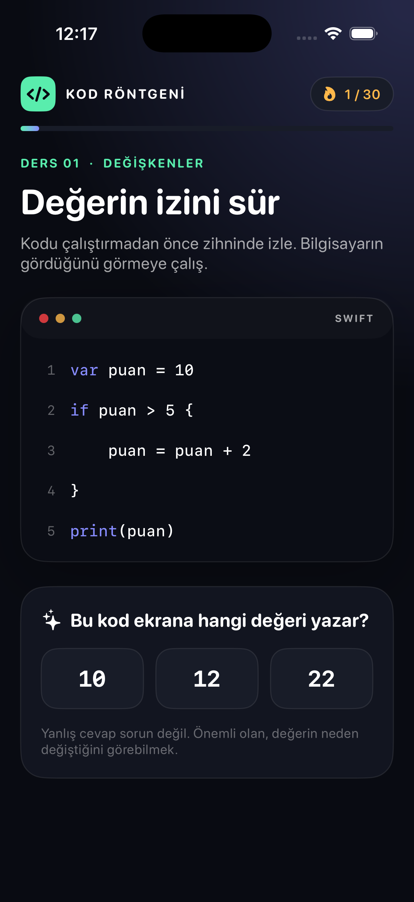

# GrillMe

GrillMe, kodlama eğitimlerinde sözdizimi arasında kaybolan insanların kodu
okumasını ve programcı gibi düşünmesini öğreten bir iOS uygulamasıdır.

> Kod ezberleme. Bir problemi bilgisayarın anlayacağı hâle getirmeyi ve çalışan
> kodun içindeki değerleri izlemeyi öğren.

İlk çalışan dikey dilimde kullanıcı kısa bir Swift kodunun çıktısını tahmin eder,
ardından “Kod Röntgeni” ile kodu satır satır çalıştırır. Aktif satır, bellekteki
değerler ve program çıktısı birlikte gösterilir.



## Belgeler

- [INTENT.md](INTENT.md): Ürün vizyonu, hedef kullanıcı ve kapsam sınırları
- [MEMORY.md](MEMORY.md): Güncel kararlar, teknik durum ve sonraki çalışma notu
- [DESIGN.md](DESIGN.md): Öğrenme deneyimi, arayüz sistemi ve teknik tasarım
- [ROADMAP.md](ROADMAP.md): MVP'den sonraki teslim sırası ve kabul ölçütleri

## Mevcut durum

Çalışan ilk ders şunları içerir:

- Swift kodunun çıktısını tahmin etme
- Çalışan satırı görsel olarak takip etme
- Değişkenlerin bellekteki güncel değerini görme
- Program çıktısını ayrı bir panelde izleme
- Yanlış tahminde cevabı vermek yerine yürütme mantığını açıklama
- Dersi tamamlayıp yeniden çözme

Oturum akışı ve başlangıç dersinin veri tutarlılığı üç otomatik testle
doğrulanmaktadır. Uygulama hem genel iOS hedefi hem de iPhone simülatörü için
başarıyla derlenmiştir.

## Gereksinimler

- macOS
- Xcode 26 veya uyumlu güncel bir Xcode sürümü
- iOS 17 veya üzeri hedef
- Swift 6

## Projeyi çalıştırma

1. `GrillMe.xcodeproj` dosyasını Xcode ile açın.
2. `GrillMe` şemasını seçin.
3. Bir iPhone simülatörü seçip Run düğmesine basın.

Kod imzalama olmadan komut satırı derlemesi:

```sh
DEVELOPER_DIR=/Applications/Xcode.app/Contents/Developer \
xcodebuild \
  -project GrillMe.xcodeproj \
  -scheme GrillMe \
  -configuration Debug \
  -destination 'generic/platform=iOS' \
  -derivedDataPath /private/tmp/grillme-derived-data \
  CODE_SIGNING_ALLOWED=NO \
  build
```

## Testler

Çekirdek öğrenme akışı bağımsız bir Swift Package hedefidir:

```sh
DEVELOPER_DIR=/Applications/Xcode.app/Contents/Developer \
CLANG_MODULE_CACHE_PATH=/private/tmp/grillme-clang-cache \
SWIFTPM_MODULECACHE_OVERRIDE=/private/tmp/grillme-swiftpm-cache \
swift test --disable-sandbox
```

## Proje yapısı

```text
GrillMe/
├── App/
│   ├── GrillMeApp.swift
│   └── ContentView.swift
└── Core/
    ├── GrillMeCore.swift
    └── IntroLesson.swift
Tests/
└── GrillMeCoreTests/
```

`Core`, SwiftUI'dan bağımsız ders ve oturum modelini içerir. `App`, bu durumu
ekrana yansıtır ve kullanıcı etkileşimlerini çekirdeğe iletir.

## Repo notu

Kök dizinde çalışan SwiftUI projesine ek olarak `grillmeapp/` altında daha önce
oluşturulmuş, stage edilmiş bir UIKit iskeleti bulunmaktadır. Hangi iskeletin
kalacağı kararlaştırılana kadar bu klasör otomatik olarak silinmemeli veya
birleştirilmemelidir. Aktif ve doğrulanmış uygulama `GrillMe.xcodeproj` dosyasıdır.
